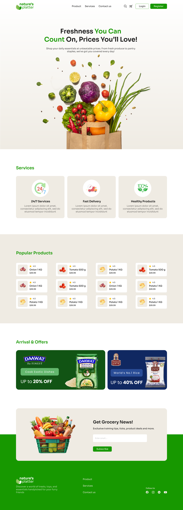
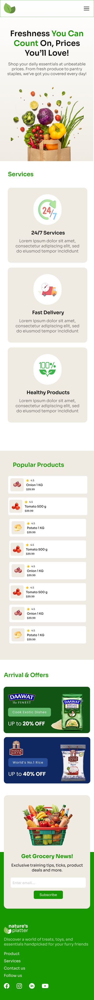

# 🍃 Natures Platter 🍽️

### Welcome to   Sohoz 😎, Sorol 😁 & Simple 🤩 Assignment 02

Hey Future Dev! 🔥  
Your mission is to build an **attractive & Ecommerce Landing Page** for:  🍃 **Natures Platter**🍽️

---

## 🧠 Marking System — Total: 60 Marks ( 50 : Main  + 10 : Challenge ) 

---

## 🎯 Your Mission  
🎥 **Watch the video** provided in the Bootcamp  
📝 **Take proper notes**  
🎯 And **complete the Requirements** exactly as shown!

---

## 🎨 UI Design Resources  

To help you craft the perfect UI, we’ve provided:

- 📁 **Figma File** – Design inspiration 💡  
- 🖼️ **Images** – Assets for your visuals 🖌️  

💾 **Download the resources** & get started  🚀

---

## ⏰ Deadline  

📅 **Assignment-02 Deadline:**  
🕛 **June 04,  11:59 PM** (Don't be late 🚩)

---

## 🚩 What to Submit  

- Your Code Repository Link  
- Your Live Link 

---

## 🖼️ Sample Preview  
<table>
  <tr>
    <th>Destop View</th>
    <th>Mobile View</th>
  </tr>
  <tr>
    <td></td>
    <td></td>
  </tr>
</table>

---

> 💬 *“Any fool can write code that a computer can understand. Good programmers write code that humans can understand.”*    - Martin Fowler 🔥    Chief Scientist at ThoughtWorks
